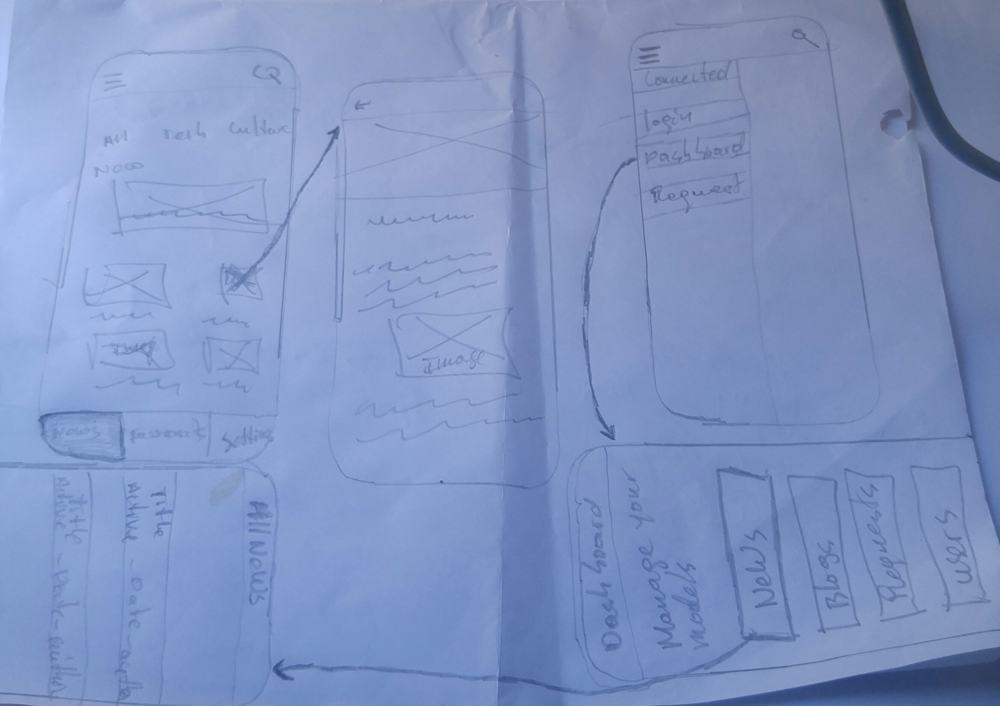
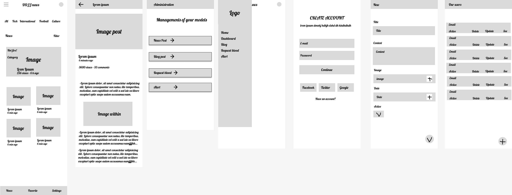

## Table of Contents
1. [Overview](#Overview)
1. [Product Spec](#Product-Spec)
1. [Wireframes](#Wireframes)

## Overview
### Description
**DDJJ News** is a local publishing news application, allowing USERS to stay informed about the situations in the country...

### App Evaluation
- **Category:** News / Education
- **Mobile:** This app would be primarily developed for mobile, also including the administration parts for adding news post.
- **Story:** While staying informed, users have possibility for reading articles, got alerted about an event, request blood, etc.
- **Market:** Any individual could choose to use this app.
- **Habit:** This app could be used as often or unoften as the user wanted.
- **Scope:** First we would start with creating the administration parts(Super-user, staff) and allowing standard users to receive news posts even no logged in in the app.

## Product Spec
### 1. User Stories (Required and Extended / Optional)

**Required Must-have Stories**

* Launch the app, shows the latest 21 news post including image, category, title, relative date format. 
* Clicking on a post should take to a detail page.
 * Displaying (image, title, date created, date updated, text, number of views, number of  comments, author name, category).
* On scrolling more posts must be added (Infinite scrolling).
* User can pull to refresh the last 21 posts.
* User can comment a post on detail page (Realtime).
* User can save post to see later.
  * User can delete saved post.
  * All saved post must be listed within an another page.
  * [X] User can log in, log out, sign up to have more functionalities like read blog, request for donation blood.
* User can filter.
  * By categories.
  * By date.
* User can search for posts by title.
* User can read blog posts.
* [X] User can request donation blood.
* When user launch without connection internet saved posts should display in the first page also (Feed).

***Only for admin, superuser, staff.****

* Management news and blog posts.
  * Create, read (Markdown for content).
  * Delete and update.
* Only superuser can add staff users.
  * Only superuser can crud whatever news, blog posts.
  * Staff users can only crud posts they added.


**Extended / Optional Stories**
* Forgot password.
* Email verification.
* Push notifications (When the app isn't running).
  * When admin add news post.
  * When receiving request blood.
  * When receiving alert.
* Authentication using oauth services (Facebook, google, ...). 
* Settings (Allowed notifications).
* System theming.
* Radio online
* User can alert other users about events (including location of the device) .
* Include an ecommerce.

***Only for admin, superuser, staff.****
* Offline editing for news and blog posts.


### 2. Screen Archetypes

* Login 
* Register - User signs up or logs into their account
* Dashboard
  * Manage creation news and blog posts
* Settings
  * Notifications settings, update photo profile, changing theme. 
* Favorites
  * All saved news Posts
* News
* Blog
* Creation news post
* Creation blog post

### 3. Navigation

**Navigation Bottom**

* News
* Favorite
* Settings

**Navigation Drawer**

* Home
* Dashboard (when admin loggedin)
* Request donation blood
* Alert
* Blog


***optional***

* Radio online
* Ecommerce

**Flow Navigation** (Screen to Screen)
* News
* Favorites
* Settings
* Log in
* Blog
* Request blood
* Alert

## Wireframes
<br>

### [BONUS] Digital Wireframes & Mockups


### [BONUS] Interactive Prototype


### VIDEO PROGRESS
SPRINT1
<br>


## Schema 
### Models
#### News

   | Property      | Type     | Description |
   | ------------- | -------- | ------------|
   | objectId      | String   | unique id for the news post (default field) |
   | title         | String   | title of the news post |
   | content         | String   | text news (markdown) |
   | active         | Boolean   | display or not |
   | author        | Pointer to User | image author |
   | image         | File     | image news posts |
   | description       | String   | trunc parts of content |
   | viewsCount    | Number   | number of views for the post |
   | createdAt     | DateTime | date when post is created (default field) |
   | updatedAt     | DateTime | date when post is last updated (default field) |
### Networking
#### List of network requests by screen
   - Home Feed Screen
      - (Read/GET) Query all posts where user is author
         ```swift
         let query = PFQuery(className:"Post")
         query.whereKey("author", equalTo: currentUser)
         query.order(byDescending: "createdAt")
         query.findObjectsInBackground { (posts: [PFObject]?, error: Error?) in
            if let error = error { 
               print(error.localizedDescription)
            } else if let posts = posts {
               print("Successfully retrieved \(posts.count) posts.")
           // TODO: Do something with posts...
            }
         }
         ```
      - (Create/POST) Create a new like on a post
      - (Delete) Delete existing like
      - (Create/POST) Create a new comment on a post
      - (Delete) Delete existing comment
   - Create Post Screen
      - (Create/POST) Create a new post object
   - Profile Screen
      - (Read/GET) Query logged in user object
      - (Update/PUT) Update user profile image
      
      
## Schema 
### Models
#### User

   | Property      | Type     | Description |
   | ------------- | -------- | ------------|
   | objectId      | String   | unique id for the news post (default field) |
   | email         | String   | unique email for each user |
   | password      | String   | minimun 8 chars |
   | profile       | File     | image profile |
   | active        | Boolean  | active or blocked |
   | isStaff       | Boolean  | if true admin, can manage news, blog posts |
   | isSuper       | Boolean  | if true superadmin, can manage all models even staff user |
   | createdAt     | DateTime | date when user is created (default field) |
   | updatedAt     | DateTime | date when user is last updated (default field) |
### Networking
#### List of network requests by screen
     

## Schema 
### Models
#### Comment

   | Property      | Type     | Description |
   | ------------- | -------- | ------------|
   | objectId      | String   | unique id for the news post (default field) |
   | text          | String   | the comment |
   | active        | Boolean  | active or blocked |
   | author        | Pointer to User | user making the comment |
   | post          | Pointer to News | which post |
   | createdAt     | DateTime | date when comment is created (default field) |
   | updatedAt     | DateTime | date when comment is last updated (default field) |
### Networking
#### List of network requests by screen


## Schema 
### Models
#### Request

   | Property      | Type     | Description |
   | ------------- | -------- | ------------|
   | objectId      | String   | unique id for the news post (default field) |
   | user         | Pointer to User   | user making the request |
   | description      | String   | mini description 120 chars max |
   | hospital       | String     | where to give |
   | active        | Boolean  | active or blocked |
   | nameFor       | String  | name of the person |
   | createdAt     | DateTime | date when request is created (default field) |
   | expiredAt     | DateTime | date when request must be destroyed |
### Networking
#### List of network requests by screen   
   
   
   
## Schema 
### Models
#### Alert

   | Property      | Type     | Description |
   | ------------- | -------- | ------------|
   | objectId      | String   | unique id for the news post (default field) |
   | description         | String   | description |
   | image         | File     | an image |
   | location      | Geo   | localization of the device |
   | user       | Pointer to user     | image profile |
   | active        | Boolean  | active or blocked |
   | createdAt     | DateTime | date when alert is created (default field) |
   | expiredAt     | DateTime | date when alert must be destroyed |

### Networking
#### List of network requests by screen

